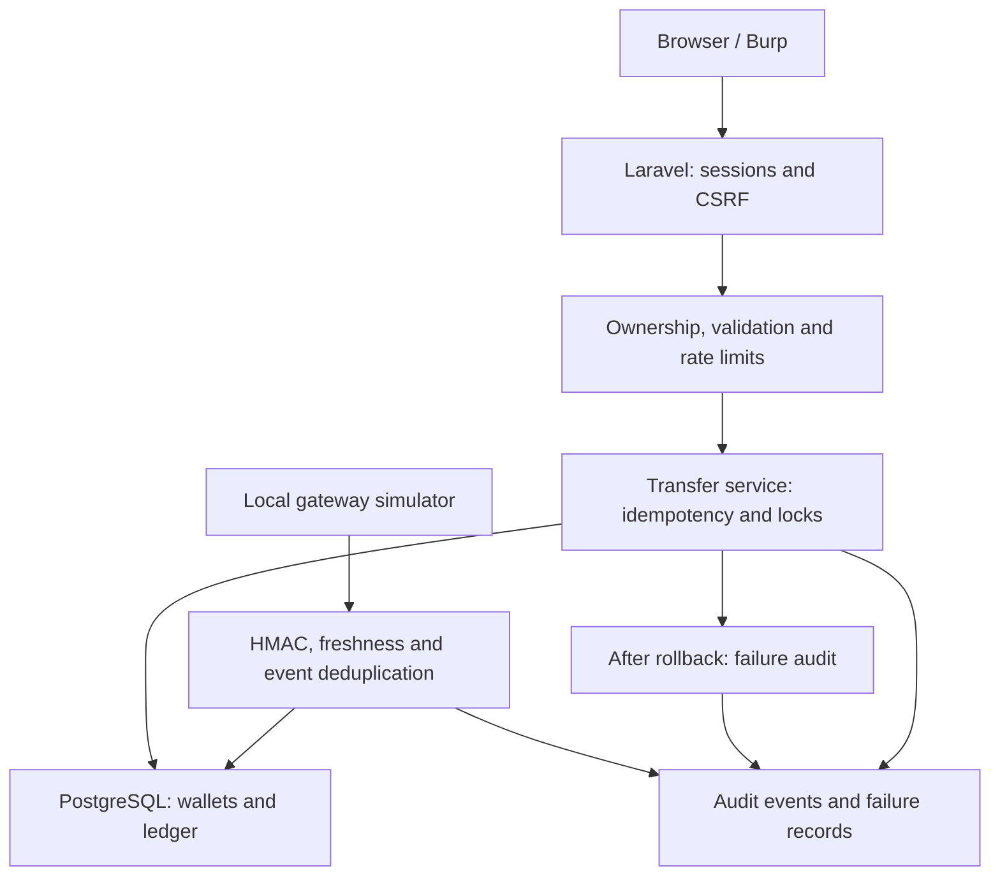

# Mini Secure Fintech Wallet — assessment report

## System overview
A local Laravel/PostgreSQL application supports registration, login, balance viewing, transfers, transaction records and logout. A local payment simulator supplies signed credit callbacks. All identities and money are synthetic. Two editions share routes and seed data, enabling controlled before/after comparisons.

## Architecture

## Security design table
| ID | Asset | Weakness and impact | Implemented control | Location | Verification |
|---|---|---|---|---|---|
| W1 | Customer balances/history | User-controlled owner ID exposes another customer's information | Gate requires authenticated subject to own requested wallet | WalletController::show and AppServiceProvider | Change owner ID; compare 200 vs 403 |
| W2 | Balance integrity | Negative amount reverses transfer direction | Decimal-string validation, positive DB constraint; money in integer paisa | WalletController, TransferService, migration | Submit -100; verify balances |
| W3 | Transfer integrity | Retry executes transfer twice | User-bound key and payload hash; sender lock and unique constraint | TransferService, transfers table | Repeat identical key; one transfer only |
| W4 | Payment credits | Forged/replayed callback creates money | HMAC over timestamp and raw body, five-minute freshness, unique event ID in transaction | WebhookController | Manual unsigned/tamper/replay observed; review HTTP expiry 401 versus vulnerable credit, manual capture pending |
| W5 | Credentials/access | Unbounded guessing attempts | Five attempts per account/IP per minute; additional 30/IP cap | AuthController | Sixth failure returns 429 |
| W6 | Consistent balances | Crash between debit/credit leaves a partial update | Database transaction; failure audit after rollback | TransferService and Audit | Injected failure assertions |
| W7 | Shared wallet balance | Competing transfers can spend the same starting funds | Ordered locks, funds recheck and nonnegative constraint | TransferService and migration | Review HTTP run: vulnerable two accepted, PKR -20,000; secured one accepted, PKR 40,000. Scheduling-dependent |

## Assets and trust boundaries
Credentials, session cookies, customer details, balances, transfer records, webhook secret and audit events are assets. Browser data is untrusted. The gateway callback crosses a separate trust boundary and does not use browser CSRF tokens; it instead proves message authenticity with a shared secret. The database enforces constraints in addition to application validation. The documented application role is a non-superuser table owner. The actual runtime connection privileges have not been independently verified; this is not a fully separated production privilege design.

## Design principles
- Confidentiality: ownership checks restrict customer information; password hashes avoid plaintext password storage.
- Integrity: validation, idempotency, signatures, constraints and atomic ledger updates protect monetary state.
- Authentication and authorization: a session identifies the user; a separate ownership decision controls each wallet read.
- Defense in depth: application validation and database constraints independently reject invalid secured monetary states.
- Availability: basic throttling reduces repeated request abuse; it does not solve denial of service.
- Accountability: audit events record selected login, read-denial, transfer and webhook outcomes. They are not tamper-proof.
- Resilience: failed secured transfers roll back. Backup/restore and failover are not implemented.

## Test evidence
The user performed Tests 1–7 on 29–30 September 2026. See TEST_RESULTS.md for observed outcomes, control names, interpretation and limitations; EVIDENCE.md maps the original screenshot names. These are user-run lab results, not a new independent penetration test. Test 7 used two PHP processes on ports 8087 and 8088 against wallet_testing. It demonstrated the expected two-request result, but no database lock-wait trace was captured. A separate expired-timestamp manual result is not recorded.

## Individual contribution
Complete honestly: author name, application/design work, testing, report work and any AI assistance required by course rules. Do not invent team members. The brief lists groups of 2–3; document the approved arrangement if submitting individually.

## Limitations and improvements
Local assessment only. No real money, external payment gateway, FIDO2, OIDC, KMS, RLS, production TLS, advanced fraud engine or high availability. Loopback HTTP is not transport encryption. Audit tables can be changed by a database owner. Recipient names/emails are intentionally shown to authenticated lab customers; a real service would need a privacy-preserving beneficiary lookup. Registration uses basic throttling; no email verification/account recovery. Add strong transaction approval, separated DB roles, immutable external audit storage, HTTPS and tested recovery before considering production use.

## Original release scope

The tested application baseline is secured commit `f41bc21293352566fe4c9a97110065ab5c5ff453` and vulnerable comparison commit `70db46f129267b2ceaf291991c1b0eac91aeeb20`. The first submission added documentation to these baselines without changing application code. The subsequent review revision below changes application behaviour and requires fresh verification. Registration, beneficiary lookup/add/remove and transfer history already exist. New accounts start at zero; beneficiaries are registered customers explicitly saved by the authenticated sender.

The seven scenarios support a bounded conclusion: the secured implementation resisted the specific exercised requests and maintained the tested monetary invariants. They do not establish universal security, production readiness or complete race-condition coverage. Original Windows screenshots describe the original release, not the revised response schema.

## Review revision

The dashboard now shows a joined transfer history with sender, receiver, amount, UTC time, status and full reference. JSON responses explicitly select public columns and omit idempotency_key and request_hash. Request validation failures are audited before entering the service; service failures, including insufficient funds and idempotency conflicts, are audited after DB::transaction unwinds. Success audit records remain atomic with financial writes. If the audit DB is unavailable a sanitized warning is attempted in the application log. Neither destination is tamper-proof; logging within an outer caller-owned transaction is not an independently durable audit channel.

Session payload encryption is enabled. Secure cookies remain disabled for the supplied HTTP loopback environment and must be enabled under HTTPS; payload encryption does not encrypt network traffic. Existing sessions should be discarded and customers should log in again after pulling. The login page no longer publishes the seed password. The lab seed credentials remain documented for reproducibility. Registration success versus rejection still enables account-existence inference; beneficiary lookup intentionally reveals a matching registered name. An out-of-band verification/invitation design is future work, not a claimed fix.

ReviewFixTest verifies required history fields and user scoping, response field minimization, rejected-transfer auditing, failure evidence surviving rollback, password removal from the login page and session encryption configuration. http_evidence.py produces numbered HTTP login attempts, before/after transfer replay data and a correctly signed expired callback. These are automated HTTP observations and must not be labelled manual Burp screenshots. The two-process concurrency script reports an unobserved vulnerable overlap as INCONCLUSIVE, not PASS. New execution results are recorded in REVIEW_RESULTS.md.
